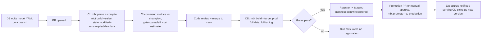

# mbt - Model Build Tool

**"dbt for machine learning models": declarative Model-as-Code, adapter-based, GitOps-native**

**Version:** 0.1 Design Proposal · **Status:** implemented in v0.1 (historical design document; current docs live in `docs/`) · **Last updated:** 2026-07-04

---

## TL;DR

mbt brings dbt's declarative, Git-centered workflow to model building. Data scientists describe a model - data, algorithm, hyperparameters, quality gates, registration target - in a reviewed YAML spec; pluggable adapters execute training; a compiled manifest pins data snapshots, config hashes, seeds, and environment digests so runs are reproducible; and `state:modified` selection retrains only what changed, making ML-in-CI economical. v0 ships one vertical slice done extremely well - declarative XGBoost training over local Parquet data, tracked and registered in MLflow - in ~18 weeks with 2 engineers and 1 DS design partner.

---

## 1. Vision & Positioning

### 1.1 The Analogy

| dbt | mbt |
|---|---|
| A *model* is a SQL file + config | A *model* is a **declarative config** (YAML) + optional Python hooks |
| Compiles SQL against an **adapter** (Snowflake, BigQuery, Postgres…) | Compiles model specs against an **adapter** (XGBoost, LightGBM, sklearn, later PyTorch, cloud trainers…) |
| `dbt run` materializes tables/views | `mbt run` trains & materializes **model artifacts** |
| `dbt test` runs data tests | `mbt test` runs data checks + **model quality gates** |
| `ref()` builds a DAG of models | `ref()` builds a DAG of **datasets → features → models → ensembles** |
| `dbt docs` generates lineage docs | `mbt docs` generates model cards + lineage |
| Jinja + `profiles.yml` for environments | Jinja + `profiles.yml` for dev/staging/prod (tracking URIs, registries, compute) |
| State: warehouse tables | State: **model registry + artifact store + manifest** |

### 1.2 Problem Statement

Data science teams today glue together notebooks, ad-hoc training scripts, and bespoke pipeline code. The *logic* of a model (data in, algorithm, hyperparameters, evaluation gates, where it gets registered) is buried in imperative Python that differs per person and per project. The result is slow review, weak reproducibility, and a notebook-to-production gap every team pays for repeatedly. dbt solved this exact problem for analytics by making transformations **declarative, versioned, testable, and dependency-aware**. mbt applies the same philosophy to model building:

> **The model config IS the model.** Training code becomes a thin, standardized execution layer provided by adapters. What teams write, review, and version is the spec.

### 1.3 What mbt Is / Is Not (v0–v1 scope)

| In scope | Explicitly out of scope (initially) |
|---|---|
| Declarative training, evaluation, registration | Model *serving* (KServe et al. consume mbt outputs) |
| DAGs of datasets → features → models | Feature store implementation (integrate, don't build) |
| Quality gates & promotion logic | Real-time/online learning loops |
| Experiment tracking & registry integration | Labeling, data ingestion |
| GitOps/CI-friendly CLI, manifest, state | A UI (CLI + generated docs first) |
| One training adapter done extremely well | Every framework at once |

### 1.4 Design Principles

1. **Declarative first, escape hatches second.** 90% of models need zero custom code; a `hooks.py` covers the rest without breaking the contract.
2. **Adapters own execution.** The core never imports XGBoost - it defines contracts; adapters implement them (exactly like dbt's adapter plugin model).
3. **Deterministic & reproducible.** A compiled manifest pins data snapshots, config hashes, seeds, and environment digests; `mbt run` twice on the same inputs = same result.
4. **CI is the primary user.** Every command is non-interactive-safe, exits with meaningful codes, and emits machine-readable artifacts (JSON manifest, run results).
5. **State-aware.** `mbt run --select state:modified+` retrains only what changed - the killer dbt feature, ported to ML (where training is 1000× more expensive than a view).

### 1.5 Success Criteria (v0.1)

- **Adoption:** ≥2 real internal models migrated from notebooks and running the full PR → CI → registry loop (Phase 5 DoD).
- **Reproducibility:** rerunning `mbt build` on an unchanged manifest reproduces metrics exactly, or within the adapter's documented tolerance tier.
- **Economy:** a typical PR retrains only the modified subgraph, with CI cost surfaced in the PR comment.
- **Extensibility:** a second adapter (LightGBM) is built against the public contract + compliance suite without touching core (Phase 4 DoD).
- **Time-to-first-model:** a new user gets from `mbt init` to a trained, registered model in under an hour via the quickstart.

---

## 2. Core Abstractions

### 2.1 Resource Types

| Resource | File | Purpose |
|---|---|---|
| **source** | `sources.yml` | External inputs: warehouse tables, lakehouse paths, feature-store feature views |
| **dataset** | `datasets/*.yml` | Declarative training-set construction: source + filters + split policy + label definition |
| **model** | `models/*.yml` | The star of the show: task, adapter, features, hyperparameters, tuning, evaluation gates, registration target |
| **metric** | `metrics.yml` | Reusable metric definitions & thresholds (e.g., `pr_auc`, `c_index`) |
| **test** | `tests/` | Data tests (schema, nulls, leakage checks) and model tests (metric gates, slice checks, calibration) |
| **exposure** | `exposures.yml` | Downstream consumers (a KServe endpoint, a batch job) for lineage & impact analysis |

### 2.2 The Model Spec (the heart of mbt)

```yaml
# models/churn_classifier.yml
version: 1

models:
  - name: churn_classifier
    description: "90-day churn prediction for active subscribers"
    task: binary_classification          # task schema validates the rest
    adapter: xgboost                     # which plugin executes this
    owner: growth-ds@company.com
    tags: [churn, weekly]

    dataset: ref('churn_training_set')   # DAG edge to a dataset resource

    target: churned_90d
    features:
      include: ["*"]
      exclude: [user_id, email, signup_ip]   # explicit leakage guards

    hyperparameters:
      max_depth: 6
      learning_rate: 0.05
      n_estimators: 400
      scale_pos_weight: "{{ auto }}"     # adapter computes from class balance

    tuning:                              # optional
      engine: optuna
      n_trials: 50
      search_space:
        max_depth: {type: int, low: 3, high: 10}
        learning_rate: {type: loguniform, low: 0.005, high: 0.3}
      objective: {metric: pr_auc, direction: maximize}

    evaluation:
      protocol: {split: temporal, test_window: "28d"}
      metrics: [pr_auc, roc_auc, ece, recall_at_precision_0.9]
      gates:                             # promotion blockers
        - metric: pr_auc
          threshold: 0.42
        - metric: pr_auc
          compare_to: production          # champion/challenger
          min_delta: 0.005
      slices: [plan_type, region]        # per-slice reporting + optional gates

    registration:
      registry: mlflow
      name: churn_classifier
      stage_on_pass: Staging             # humans/CD promote to Production

    materialization: model_artifact      # or: ensemble, calibrated, onnx
    seed: 42
```

**Why this works:** the `task` field selects a **task schema** (Pydantic) that validates the config; the `adapter` field selects the plugin that can execute that task. New tasks (survival, ranking) and new adapters (lightgbm, sklearn) slot in without touching core.

### 2.3 Dataset Spec

```yaml
# datasets/churn_training_set.yml
datasets:
  - name: churn_training_set
    source: source('lakehouse', 'gold_subscribers')   # or feature_store ref
    label:
      column: churned_90d
      definition: "cancelled within 90d of snapshot_date"
    filters: ["is_active = true", "tenure_days >= 30"]
    split:
      strategy: temporal
      time_column: snapshot_date
      train: "-180d:-28d"
      test: "-28d:now"
    snapshot: iceberg_snapshot_id        # pinned at compile time for reproducibility
    checks: [no_future_columns, label_leakage_scan, class_balance_report]
```

### 2.4 DAG & `ref()`

`ref('churn_training_set')` and `ref('churn_classifier')` build the dependency graph, enabling:
- `mbt run --select churn_classifier+` (model and downstream ensembles)
- `mbt run --select +churn_classifier` (upstream dataset build first)
- `mbt run --select tag:weekly,state:modified+` (CI: only weekly models that changed - comma is intersection, dbt-style)
- Ensembles/stacking declared as models whose inputs are `ref()`s to other models.

---

## 3. CLI Design

```
mbt init <project>          # scaffold project (like dbt init)
mbt deps                    # install adapter packages pinned in packages.yml
mbt parse                   # validate configs, build DAG (fast, no execution)
mbt compile                 # resolve Jinja + profiles + snapshots -> manifest.json
mbt run [--select ...]      # build datasets + train models per DAG order
mbt test [--select ...]     # data tests + model quality gates
mbt build                   # run + test in DAG order (the CI workhorse)
mbt evaluate --model X      # re-evaluate an existing artifact on fresh data
mbt promote --model X --to production   # registry stage transition (GitOps-gated)
mbt docs generate|serve     # model cards + lineage site
mbt ls / mbt show           # inspect resources & compiled configs
mbt state diff              # what changed vs. a previous manifest
mbt run-operation <macro>   # escape hatch, dbt-style
mbt clean                   # remove target/ artifacts
```

**Conventions mirrored from dbt:** `profiles.yml` (environments: tracking URI, registry, artifact store, compute), `--target dev|prod`, `--vars`, `target/manifest.json` + `run_results.json`, exit codes (0 pass / 1 error / 2 gate failure), `--threads` for parallel branch execution.

**Project layout:**

```
my_ml_project/
├── mbt_project.yml          # name, version, adapter defaults, var defaults
├── profiles.yml             # (or ~/.mbt/profiles.yml) env config
├── packages.yml             # adapter + package pins
├── sources.yml
├── datasets/
│   └── churn_training_set.yml
├── models/
│   ├── churn_classifier.yml
│   └── churn_classifier.py      # optional hooks: custom features/metrics
├── metrics.yml
├── tests/
│   └── assert_no_leakage.py
├── macros/
└── target/                  # compiled manifest, run results (gitignored)
```

---

## 4. Adapter Architecture

### 4.1 Contracts (core defines, plugins implement)

```python
# mbt-core: contracts only - no ML framework imports, ever.

class TrainingAdapter(Protocol):
    name: str
    supported_tasks: set[TaskType]        # {BINARY_CLASSIFICATION, REGRESSION, ...}

    def validate(self, spec: ModelSpec) -> list[ValidationIssue]: ...
    def resolve_auto(self, spec, dataset_profile) -> ModelSpec: ...   # e.g. "{{ auto }}"
    def train(self, spec, data: DatasetHandle, ctx: RunContext) -> TrainedModel: ...
    def evaluate(self, model, data, metrics) -> MetricResults: ...
    def export(self, model, format: ArtifactFormat) -> ArtifactRef: ...

class DataAdapter(Protocol):              # where datasets come from
    def build_dataset(self, spec: DatasetSpec, ctx) -> DatasetHandle: ...
    def snapshot_id(self, source) -> str: ...

class TrackingAdapter(Protocol):          # experiment tracking
    def start_run(self, ctx) -> RunHandle: ...
    def log(self, run, params, metrics, artifacts): ...

class RegistryAdapter(Protocol):          # model registry
    def register(self, artifact, name, metadata) -> ModelVersion: ...
    def get_champion(self, name, stage) -> ModelVersion | None: ...
    def transition(self, version, stage): ...

class ComputeAdapter(Protocol):           # where training runs
    def submit(self, job: TrainingJob) -> JobHandle: ...   # local | k8s | ray
```

- **Discovery:** Python entry points (`mbt.adapters` group), exactly like dbt - `pip install mbt-xgboost` and `adapter: xgboost` just works.
- **Task schemas** are also pluggable: an adapter declares which tasks it supports; core validates spec ↔ task ↔ adapter compatibility at `mbt parse` time.
- **Versioned contract** (`mbt-adapter-base`) so adapters pin against a stable interface.

### 4.2 First Adapter Choice: **XGBoost** (recommended)

| Criterion | Why XGBoost wins for v0 |
|---|---|
| Coverage | Handles binary/multiclass classification, regression, ranking, even survival (AFT) - one adapter, many tasks later |
| Config-friendliness | Nearly everything is a hyperparameter dict → maps perfectly to YAML |
| Team reality | The workhorse of tabular DS teams; instant credibility |
| Simplicity | No GPU/distributed complexity required for v0; deterministic with a seed |
| Artifact story | Native save/load + ONNX export path |

Companion defaults for v0 (thin, swappable): **DataAdapter = Parquet/Iceberg via DuckDB or Polars**, **TrackingAdapter = MLflow**, **RegistryAdapter = MLflow Registry**, **ComputeAdapter = local subprocess** (K8s Job and Ray adapters in v1).

sklearn is the alternative first pick (broadest algorithms via `Pipeline`), but its config surface is messier; LightGBM is a near-clone follow-up once the XGBoost adapter proves the contract.

---

## 5. GitOps & Workflow

### 5.1 The Loop



### 5.2 Key GitOps Mechanics

- **Git is the source of truth for specs; the registry is the source of truth for artifacts.** The compiled `manifest.json` (stored per run, e.g., in S3 or as a CI artifact) links the two: config hash ↔ data snapshot ↔ model version.
- **`state:modified` retraining:** CI diffs the new manifest against the last production manifest; only models whose config, dataset spec, upstream deps, or pinned data snapshot changed get retrained. This is what makes ML-in-CI economically sane.
- **Champion/challenger gates in config** (`compare_to: production`) mean promotion criteria are reviewed in PRs like any other code.
- **Promotion as PR:** `mbt promote` can run in a pipeline triggered by a reviewed "promotion file" change (pure GitOps) or via a manually-approved CD stage - support both.
- **Environments via `profiles.yml` targets:** dev (sampled data, 5 tuning trials, local MLflow) vs prod (full data, 50 trials, prod registry). Same specs, different target.
- **Scheduled retraining = CI cron:** nightly/weekly `mbt build --select tag:weekly` - no new orchestrator concept needed for v0; Airflow can simply shell out to mbt later.

---

## 6. Engineering Best Practices Baked In

**For Data Scientists (users of mbt):**
- PR-reviewed model changes; no notebook-to-prod gap - the YAML *is* what runs.
- Leakage guards as config (`features.exclude`, dataset `checks`) and as tests.
- Temporal splits by default for time-dependent problems; random split must be opted into.
- Seeds mandatory; `mbt run` warns if any nondeterminism source is detected.
- Auto-generated **model cards** (`mbt docs`) with lineage, data window, metrics, slices, owner.

**For MLOps Engineers (builders/operators of mbt):**
- `mbt-core` = pure Python 3.11+, typed (mypy --strict), Pydantic v2 schemas, zero ML deps.
- Plugin repos per adapter with a shared **adapter compliance test suite** (like dbt's) - an adapter passes the suite or it doesn't ship.
- Semantic versioning + versioned adapter contract; deprecation policy from day one.
- Structured logging (JSON), OpenTelemetry hooks, machine-readable `run_results.json`.
- Golden-path template repo (`mbt init` output) encoding conventions: pre-commit (ruff, mypy, yamllint), CI workflows, CODEOWNERS on `models/`.
- Docs-as-code (mkdocs-material), ADRs for design decisions, conventional commits + release automation.

---

## 7. Tech Stack for Building mbt Itself

| Concern | Choice | Notes |
|---|---|---|
| Language | Python 3.11+ | Meets DS ecosystem where it lives |
| CLI | **Typer** (Click-based) + Rich | dbt-like UX, pretty tables/progress |
| Config schemas | **Pydantic v2** | Validation, JSON-schema export for editor autocomplete |
| Templating | **Jinja2** | `{{ var() }}`, `{{ env_var() }}`, macros - dbt muscle memory |
| DAG | **networkx** | Topological sort, selectors, cycle detection |
| Parallel execution | `concurrent.futures` (v0) → ComputeAdapter (v1) | `--threads` semantics |
| Data handling | **Polars** + **DuckDB** + PyArrow | Fast local dataset builds; Iceberg via pyiceberg |
| First adapters | xgboost, mlflow (tracking+registry), optuna (tuning) | Separate pip packages |
| Plugin system | `importlib.metadata` entry points | `mbt-<adapter>` naming convention |
| Packaging | **uv** + hatchling, monorepo (core + adapters) | Fast, modern |
| Testing | pytest + hypothesis + adapter compliance suite | Golden-file tests for compile output |
| Lint/type | ruff + mypy --strict | Pre-commit enforced |
| Docs | mkdocs-material; model-card HTML via Jinja | `mbt docs serve` |
| CI/CD | GitHub Actions; release-please | Also the reference user CI templates |

---

## 8. Delivery Roadmap

| Phase | Duration | Deliverables | Definition of Done |
|---|---|---|---|
| **0 - Spike & spec** | 2 wks | Naming, ADRs, Pydantic schemas for project/dataset/model, `mbt init/parse/ls` | A demo project parses; JSON schema published for editor autocomplete |
| **1 - Vertical slice** | 4 wks | `compile` (Jinja, profiles, manifest), `run` for **XGBoost binary classification**, local Parquet DataAdapter, MLflow tracking, seed/reproducibility | `mbt build` trains a real churn model end-to-end from YAML; rerun = identical metrics |
| **2 - DAG & gates** | 4 wks | `ref()` DAG + selectors, dataset resources, `mbt test` (data tests + metric gates), champion/challenger vs registry, `run_results.json` | Multi-model project with dependencies; failing gate blocks registration with exit code 2 |
| **3 - GitOps & state** | 3 wks | `state:modified` selectors + `mbt state diff`, manifest storage convention, reference GitHub Actions (PR check + prod build + promotion), `mbt promote` | The full loop in §5.1 runs on a demo repo; PR comment bot shows metric deltas |
| **4 - Adapter hardening** | 3 wks | Extract `mbt-adapter-base`, compliance test suite, Optuna tuning support, `mbt docs` model cards + lineage site | A second adapter (LightGBM) built by "someone else" using only public contracts + suite |
| **5 - v0.1 release** | 2 wks | Packaging on PyPI, docs site, quickstart tutorial, template repo, dogfood on 2–3 internal models | External-quality README + tutorial; two real models migrated from notebooks |
| **Later (v1+)** | - | K8s/Ray ComputeAdapters, sklearn/PyTorch adapters, survival & ranking task schemas, Feast DataAdapter, ensembles, batch scoring (`mbt score`), Airflow provider | Driven by dogfooding feedback |

**Timeline:** ~18 weeks (~4.5 months) to v0.1 · **Team shape:** 2 engineers + 1 DS design partner is enough through Phase 5.

---

## 9. Risks & Open Questions

| Risk / Question | Position |
|---|---|
| "YAML hell" - configs grow unwieldy | Task schemas keep them small; `hooks.py` escape hatch; macros for repetition; resist adding knobs until dogfooding demands them |
| Training in CI is slow/expensive | `state:modified` selection, sampled dev targets, tuning-trial caps per target, cost estimate in PR comment |
| Overlap with Kubeflow/ZenML/Metaflow | Those are *pipeline/orchestration* tools (imperative Python). mbt is a *declarative spec + build tool* that can run inside them - complement, not competitor. Keep scope discipline |
| Where does feature engineering live? | v0: in the dataset source (dbt/warehouse) or `hooks.py`. v1: Feast DataAdapter. mbt should not become a feature engineering DSL |
| Registry as deployment trigger vs mbt deploying | mbt stops at the registry + exposures; serving CD (Argo) reacts to registry stages. Clean seam |
| Nondeterministic training (GPU, threads) | Document determinism tiers per adapter; gates use tolerance bands where exact reproducibility is impossible |
| DS adoption - "I'll just keep my notebook" | Golden-path `mbt init`, one-hour quickstart, model cards and state-aware CI as carrots; migrate 2–3 flagship models alongside a design partner before broad rollout |
| Secrets & credentials in `profiles.yml` | Follow dbt: resolve via `{{ env_var() }}`, keep profiles outside the repo by default, never write secrets into the manifest |
| Name collision check | Verify "mbt" availability on PyPI/GitHub before public release |
